# *Trump says*. PDA with NLP+visualization for 35 Trump rallies from 2019-2020.

### **Objective**: 
- Helping to solve basic PDA with NLP.

### **Main tools**: 
- spaCy, NLTK, visualization (matplotlib, plotly, seaborn, yellowbrick)
- language: Python :snake:

### **Dataset**:
- https://www.kaggle.com/christianlillelund/donald-trumps-rallies

### **Content**:

    1. Word frequencies
    What's the speech average length and unique words count?
    Which words are more common per word category (noun, adjective and verb)?
    Are verbs used more or less than nouns?
    Which are the most common ngrams?

    2. Named Entities
    Which types of words usually accompany certain NEs?
    Which are the most common NEs for person, organization and geopolitical entities?

    3. Word distributions
    Do certain words appear evenly distributed through the speeches or is it more a temporary usage?
    How two or more words compare in frequency distribution?
    Do certain words appear in the same context?

    4. Sentiment
    Which is the overall sentiment?
    Which is the sentiment flow within the speeches? Is there a pattern?
    Which sentiment usually describes a certain NE?

### **Results**:

**1. Word frequencies**:

Our main question here was how complex is the discourse. For the given speeches, the language used proved to be quite simple, with 0.12% of the total unique words accounting for 10.83% of the total oral text. 

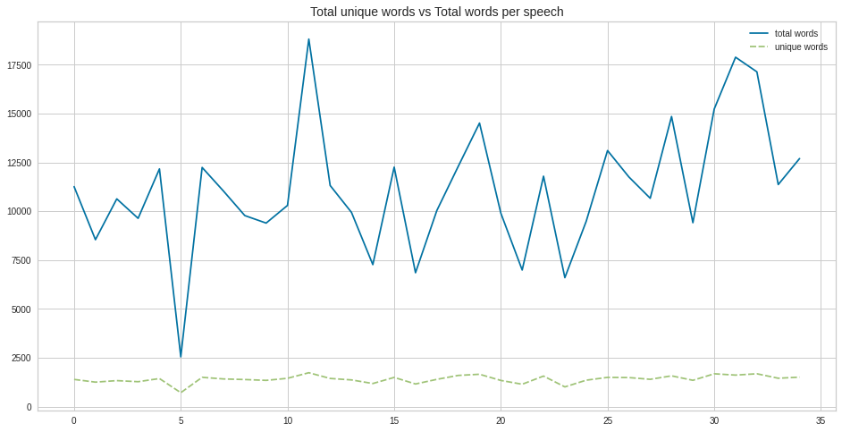

Furthermore, we looked at the noun/verb ratio, linked to the amount of tension in the political discourse. While [Carlos Ahumada's analysis](https://towardsdatascience.com/nlp-using-spacyr-to-analyze-presidential-speeches-49c10ef37aef) reported a score of 1.24 for Trump's inauguration speech back in 2016 (meaning slightly more nouns are used compared to verbs, i.e., less tension), our analysis shows a drop to 0.91 (increasing tension).

**2. Named Entities**:

The purpose of this section was to see the use of different named entities in Trump's rallies (person, geopolitical and organization entities).

While for organizations the amount of mentions to the respective entities are much more balanced (see [here](https://plotly.com/~jebefor/9/) the interactive plot), we observed that for person Joe Biden (24.4%), Donald Trump (13.6%), Hillary Clinton (7%) and Mike Pence (6.52%) make up more than half the mentions to person names (plot [here](https://plotly.com/~jebefor/1/)). Even more, America (33.1%) and China (14.1%) alone make up almost 50% the mentions of geopolitical entities (plot [here](https://plotly.com/~jebefor/7/)).

A good illustrator of these results are the collected wordclouds on the types of words that usually accompany these entities (i.e., nouns, verbs and adjectives). 
Not only these clearly show a focus on certain entities over others that we can expect from the political context, but also show a different treatment depending on the gender in both frequency (lower) and types of accompanying words (mentions to attractiveness, both in the case of women).

- Examples: 

ent: **Ivanka**, word type: adj

ent: **Kamala**, word type: noun

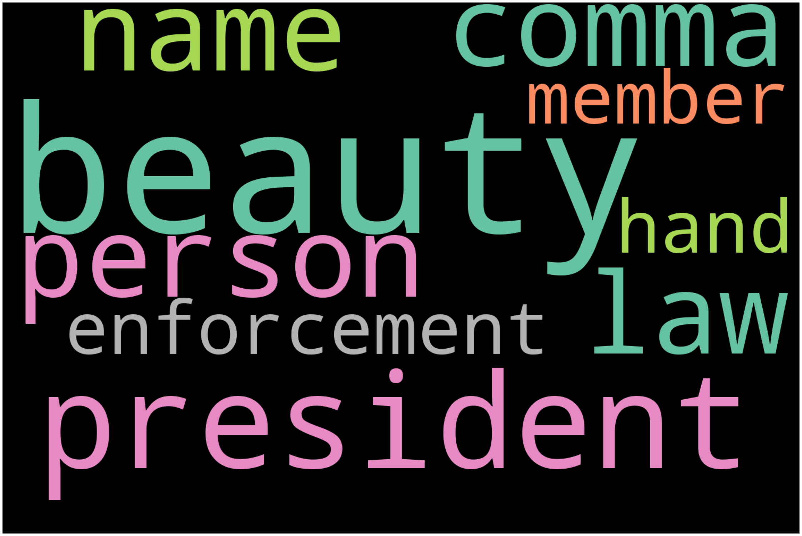

ent: **Joe**, word type: adj

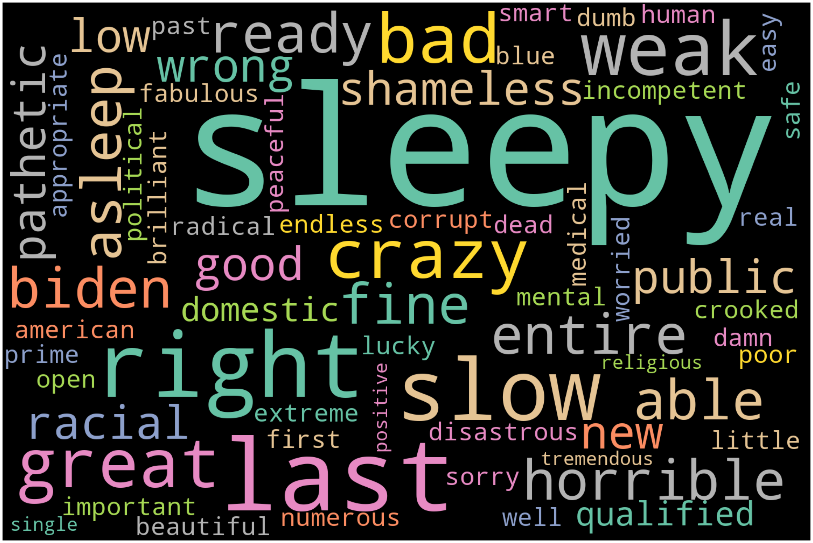

ent: **AOC**, word type: adj

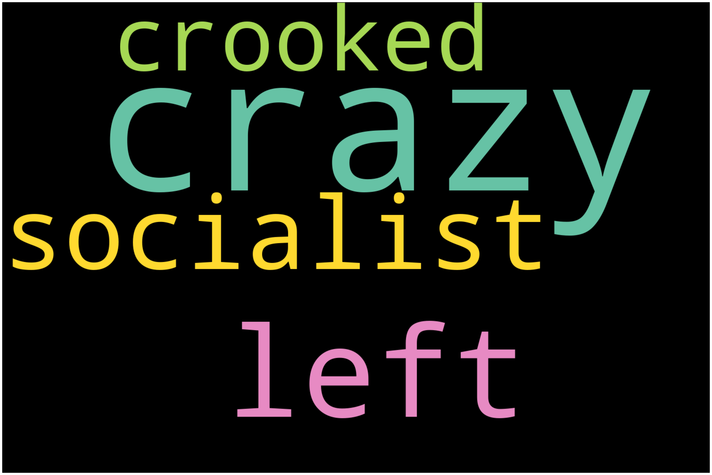

ent: **Bernie**, word type: adj

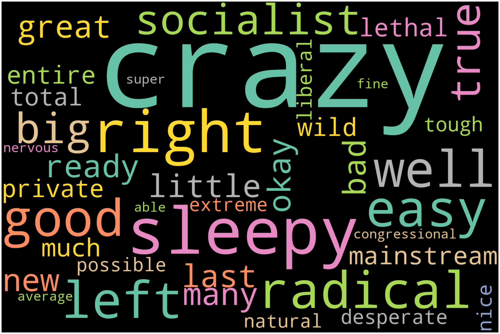

**3. Word distributions**:

In this part of the analysis we go over two different approaches to see how words are distributed throughout the discourse.

The first one deals with single word frequencies over the rallies, as seen in the examples below. Red and blue hues correspond to the winning party in the cities' state in the 2016 Elections. Thus we can observe the importance a given word has at both the global and local level of the speech.

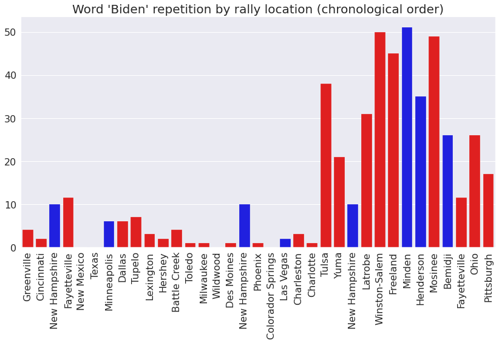

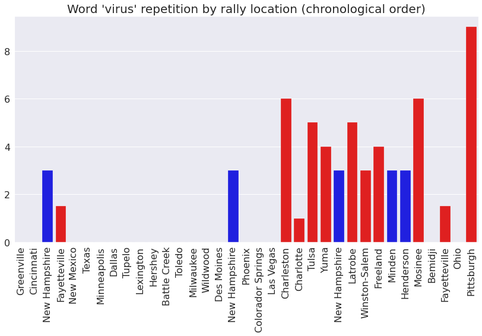

In the second approach, we look at lexical dispersion plots to:

- compare the frequency of several words at a time:

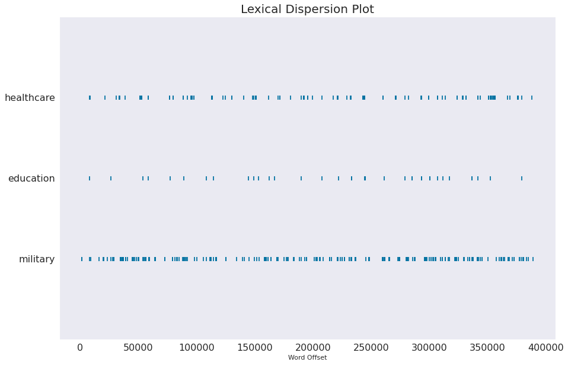

- or to see if these words usually occur in the same context:

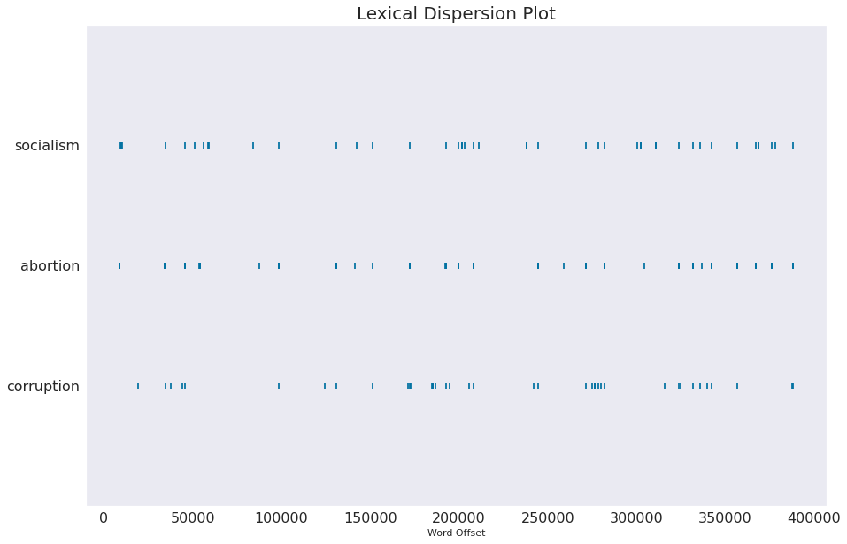

**4. Sentiment**:

In the last part of the analysis we go over the predominant sentiment in the speeches and towards certain entities.

Being -1 the most extreme negative and 1 the most extreme positive, the average compound (sentiment) rate for all rally speeches is of 0.16.

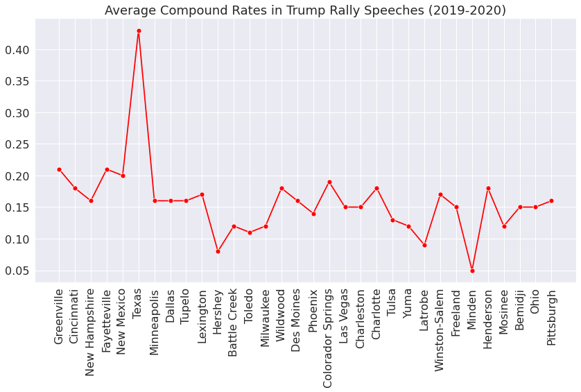

Another interesting observation we make is comparing the overall pattern for different periods, taking into account a certain event. In our case, we look at how the COVID-19 pandemic may have affected the intensity of the sentiment flow.

*Before April 2020*

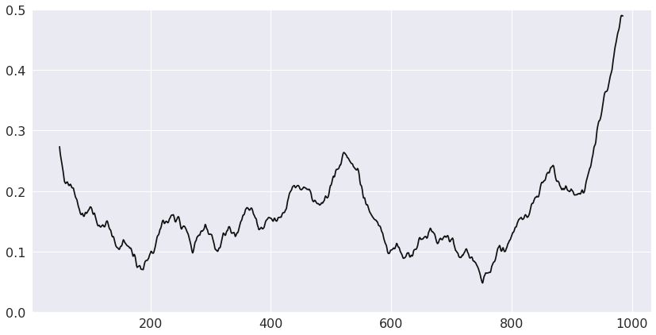

*After April 2020*

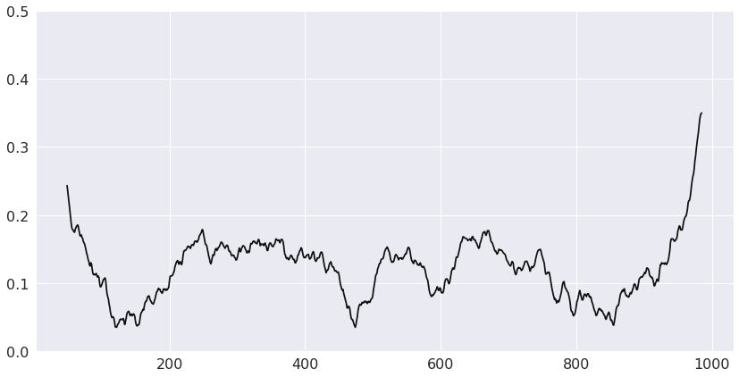

Finally, concerning sentiment rates of words accompanying certain named entities, we look at some remarkable examples by calculating the mean over the sentiment of all adjectives that come up in the same context window.

*keyword* | Bernie | Biden | Obama | China | Trump | America | Pence 
--- | --- | --- | --- | --- | --- | --- | --- 
*sentiment compound* | -0.15 | -0.09 | 0.07 | 0.14 | 0.23 | 0.42 | 0.54

### **Conclusion**:

NLP proves to be a very useful tool for political text analytics with great potencial to solve more complex questions involving metonomies, contrastive pairs or responsible actors, to name a few. 

For the case at hand, it helped us to understand the complexity of the text, the amount of tension in the discourse, the portrayal of different named entities, the distribution of keywords throughout the discourse and their coexistance, the overall sentiment of Trump's discourse and Trump's sentiment on given NEs, as well as the different sentiment patterns of the overall discourse observed related to specific conditions (e.g. COVID-19).

As a final note, we observed a need to train the language model to have more accurate results both at the global language level (e.g. identify 'many' as adverb instead of adjective) and at the dataset language level (e.g. identify 'Obama Administration' as organization instead of just 'Obama').
